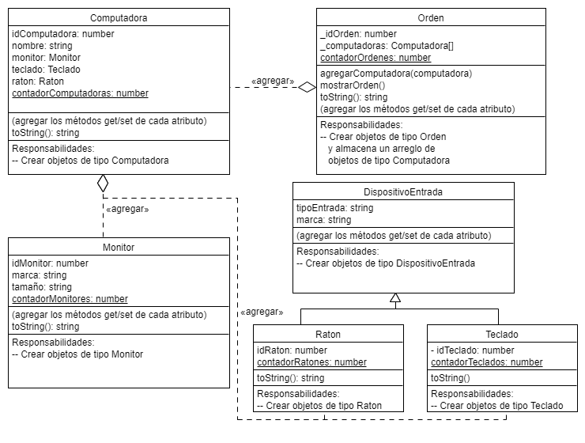

# Practica POO

De acuerdo al diagrama realice.
- Crear cada uno de las entidades.
- Aplicar los pilares de Programacion Orientada a Objetos.
- Persistir los registros de orden en un archivo Json.
- Aplicacion consola.